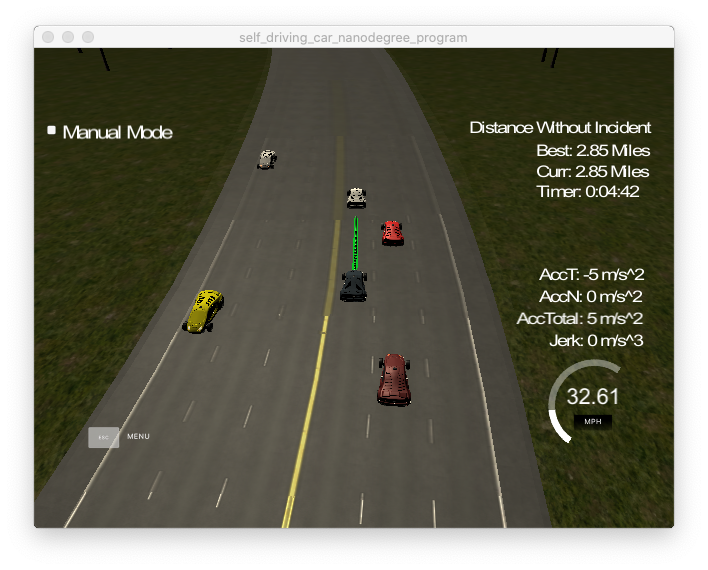

# Model documentation



## Compilation
The code compile without errors with cmake and make as expected. For development VSCode was used along with Google's C++ styleguide CMakeLists.txt remanind unchanged.

## Valid Trajectories
### The car is able to drive at least 4.32 miles without incident.
The is able to drive 4.32 miles and even more with incidents. The current settings are tuned to be relatively conservative when it comes to lane change maneuvers but it can be configured to be more aggresive. The corresponding settings are:
- `int front_safe_distance = 20;` (line 119) gap in front of our car to a vehicle in an adjacent lane.
- `int rear_safe_distance = 15;` (line 120) gap behind our car to a vehicle in an adjacent lane.
- `ref_vel -= .224;` deceleration rate (line 186) when car in front is detected
- `ref_vel += .224;` acceleration rate (line 189) towards reaching the speed limit

### The car drives according to the speed limit.
```cpp
else if (ref_vel < 49.5) {
  ref_vel += .224;
}
``` 
At line 188 we check for the current speed (ref_vel) and only increase it is we haven't reached it yet
### Max Acceleration and Jerk are not Exceeded.
Acceleration rate is set at line 189 as indicated above.
Low jerk is ensure with those measures:
1. We wait for lane changes to complete before issuing another lane change. The current lane is always calculated dynamically on each loop run by snapping the car's `d` to one of the lanes (line 110)
2. We use the remanining points from the previous path to ensure the path transition is smooth (lines 219 to 232)
3. We use use splines to create smooth curves (line 235 to 301)
### Car does not have collisions.
- The car constantly checks if there is a car in the lane in front of it and sets the `too_close` variable accordingly (line 137)
- The car checks for gaps in the adjecent lanes in order to make a lane change if needed. On line 192 we print in the console the lane occupancy as it is perceived from the car.
### The car stays in its lane, except for the time between changing lanes.
The car always tries to be centered in its lane when it is not blocked by a car in front of it, only adjusting its speed (line 188)
### The car is able to change lanes
Instead of a state machine, a simple `target_lane` property was introduced to let the car know that we want to proceed to a specific lane. When the car cruises in its lane `target_lane` is equal to `current_lane`. The car overall:
1. prefers overtaking from the left (line 181)
2. goes to its right lane only if the left is not availble (line 183)
3. only slows down if it is trapped (line 185)
